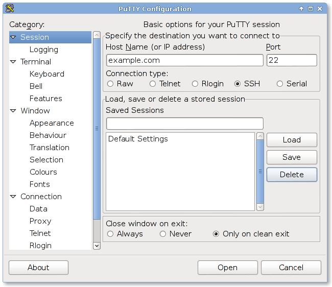

# Mac OS X

[An Intro to SSH](http://blog.softlayer.com/2011/unix-sysadmin-boot-camp-an-intro-to-ssh/) give a one-line instruction.

[Terminal icon](http://www.iconspedia.com/icon/terminal-13468.html)

open Terminal ( look in Finder under Applications >> Utilities ).
Type "ssh root@example.com"

ssh is the SSH command.  "root" is the user logging into the server.  "example.com".  You can use either the domain name pointing to the server, or the IP of the server.

# Windows

Windows does not include an SSH client.  In fact, Windows has stopped including the predisessor telnet.  Therefore, download an SSH client.  A popular SSH client is Putty.  I can be downloaded [here](http://www.chiark.greenend.org.uk/~sgtatham/putty/download.html)

Choose the .exe version of putty.  It's easy to install, and start using.  Double click it's icon and you should see a login screen.

Once you have logged in,you can peruse an [introduction to SSH](http://blog.softlayer.com/2011/unix-sysadmin-boot-camp-an-intro-to-ssh/) and other related articles on the SoftLayer [blog](http://blog.softlayer.com/tag/ssh/). and (Kn
http://knowledgelayer.softlayer.com/
